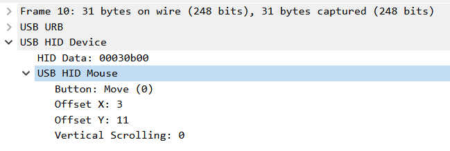
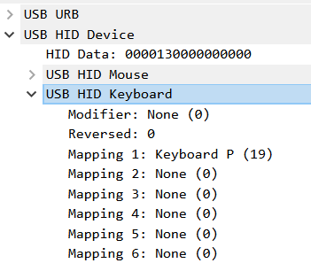

# Wireshark Lua Plugins

## 简介

这是自用自写的 Wireshark Lua 插件，用于扩展 Wireshark 的流量分析功能。

将所有内容导入 Wireshark 的个人 Lua 插件文件夹即可使用，一般是 `%APPDATA%\Wireshark\plugins`。

## USB HID Device

目前实现了 USB HID Mouse 和 USB HID Keyboard 的简单分析，只针对 8 字节和 4 字节适配，有考虑添加额外的菜单选项来适配不同的流量包，但目前没写此功能。

预期功能如下

## WebShell

> 目前计划，目的是支持最基本常见默认参数下的 WebShell 的行为分析。

## VMess

> 目前计划，目的是支持最基本的 VMess 协议流量解密。